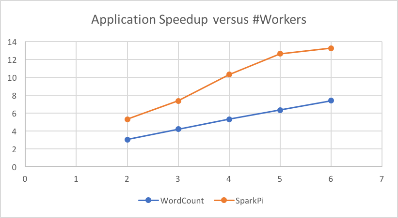
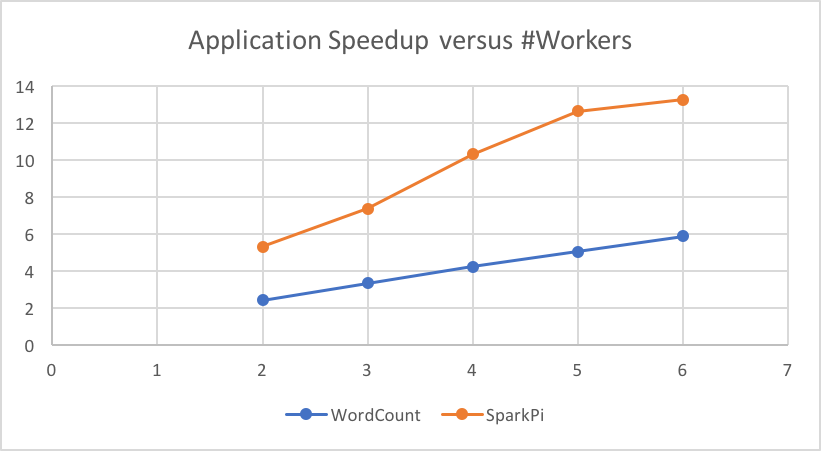

**Final Write Up** [Proposal](https://github.com/linzebing/MiniSpark/blob/master/Proposal.md) and [Checkpoint](https://github.com/linzebing/MiniSpark/blob/master/Checkpoint.md)

Team member: Zebing Lin (zebingl)

# Summary
  I implemented a mini Spark-like framework named MiniSpark that can run on top of a HDFS cluster. MiniSpark supports operators including *Map*, *FlatMap*, *MapPair*, *Reduce*, *ReduceByKey*, *Collect*, *Count*, *Parallelize*, *Join* and *Filter*. The Github repo is [https://github.com/linzebing/MiniSpark](https://github.com/linzebing/MiniSpark).
  
  Rdd fault tolerance and worker fault tolerance are supported.

# Background
Google's MapReduce has been very successful in implementing large-scale data-intensive applications, however it's
deficient in iterative jobs/analytics, due to the fact that MapReduce has to write intermeidate results to HDFS, incurring
sigificant performance penalty. By introducing the concepts of *resilient distributed dataset* (RDD), Spark reuses
working sets of data across multiple parallel operations, therefore enhancing the overall performance.

Data locality of Spark lies in HDFS data locality and locality preserving in applying transformaitons on RDDs (more on this later). The parallelism of Spark comes from multi-machine parallelism and multi-core parallelism. To be more specific, see the graph below 

*Spark Overview*

Essentially, Spark's master node will manage a bunch of worker nodes, and inside each node, there are several executors (usually equal to the number of cores). The driver program on the master will distribute computations to the executors on these workers, therefore leveraging both levels of parallelism.

Data is abstracted into RDDs. More specifically, it's splited in some way into **partitions** in the workers' memory. Each executor's execution will be on the granularity of a partition. There are two dependency types between RDDs. *Wide* dependency means the partition relies on multiple partitions of its parent RDD, while *Narrow* dependency means the partition relies on a single partiton of its parent RDD.


*Spark Execution*

# Approach

*System Architecture of MiniSpark. Scheduler/Master is on the name node of the HDFS cluster. Each worker node is also a data node in the HDFS cluster.*
## RDD Data Abstraction
```java
  class Partition {
    public int partitionId; // Unique identifier of a partition
    public String hostName; // Worker Machine DNS of the partition
  }

  public class Rdd {
    public DependencyType dependencyType; // Wide or Narrow
    public OperationType operationType; // Map, Reduce, FlatMap...
    public Rdd parentRdd; // Rdd that this current Rdd is derived from
    public int numPartitions; // Number of Partitions
    public String function; // Function name for Map, Reduce…
    public ArrayList<ArrayList<String>> hdfsSplitInfo;
    public ArrayList<Partition> partitions; // Partition Info
    ......
  }
```
The RDD data structure maintains *parentRdd* to track the RDD that this current RDD is derived from. *function* keeps the name of input function literal (I used reflection to pass function literals). *partitions* keeps track of partition information of the RDD, each with a unique paritition ID and its worker machine's host name.

## Scheduler
Scheduler builds the lineages of RDDs and track the lineage across a wide range of transformations. When a RDD action is invoked, the scheduler will examine the full lineage of the RDD and identify an execution order.


*Lineage Graph of a Spark Program*

Scheduling process following the following steps:

- Extracting stages before a wide dependency. The RDD that is wide dependent on has to be materialized first to enable further operations.
- Trace back the dependent RDDs in a recursive fashion and aggregate lineages. As MiniSpark doesn't support *union* and *join* yet, therefore each RDD will only depend on one parent RDD. If MiniSpark has to support *union* and *join*, then we should build a DAG of the lineage, and apply transformation in topologically order.
- Send aggregated lineages, execute stages and apply partition transformations in parallel.

When scheduler has to assign a job, it will prefer worker with data stored on the machine.

## Master
Master maintains status of workers and commmunicates with workers via RPC calls. I used [Apache Thrift](https://thrift.apache.org) to enable RPC communication between master and workers (and workers and workers as well!). The master keeps states of jobs running on workers, and always try to allocate jobs to the least-loaded machine to achieve load balacning, while taking data locality into account.

## Workers
Workers will read data from HDFS, parallelized arrays from master or shuffled partitions from other workers. It will perform computation according to the received lineages and store the results in memory. The workers' jobs are decided by scheduler and distributed by the master.

Each worker has a hash map, which maps partition ID to partition data. Note that to preserve data locality and reduce memory footprints, it will not materialize intermmediate RDDs unless being given a cache hint. It will find the most recent RDD that is still in memory, and apply transformations in a streamingly fashion. I used reflection to pass function literals.

## Parallelization and Optimization
### Multi-machine Parallelism
Thrfit RPC calls are synchronous. To enable cross-worker parallelism, I spawn a thread for each RPC call. As Thrift client calls are thread-unsafe, the same number of clients per machine are set up in advance, and each will be used by a RPC call at time. Generally, RPC call threads will wait to acquire locks of these clients, and the workers will always be fully loaded.

### Multi-core Parallelism
Multi-core parallelism is provided by Thrift RPC server. It will automatically spawn threads for each RPC call:

```java
  TServer server = new TThreadPoolServer(new TThreadPoolServer.Args(serverTransport).processor(processor));
```

The scheduler will never be overloaded with more threads than #cores, guaranteed by the scheduler/master.

### Optimization
The most important optimization is to process narrowly dependent RDDs in a streaming fashion, rather than invoke a RPC call for every transformation (which will materialize intermediate RDDs). This great benefits data locality and reduces memmory footprint, and will provide around 3-4x speedup if the lineage is long. Another optimization is to precompute the reflection methods instead of computing it in every iteration in traversal of a partition.

# Results
Experiments were conducted on AWS using the r3.xlarge (4 vCPUs, 30GB memory) instance type. HDFS cluster was set up through AWS EMR.

## Application 1: WordCount
WordCount is the most commonly used example of MapReduce/Spark. The following code counts the words that start/end with "15618" from a 22GB text file ([source](http://commoncrawl.org/the-data/)). It's both I/O intesnive and computation heavy.
```java
  public static String toLower(String s) {
    return s.toLowerCase();
  }

  public static ArrayList<String> flatMapTest(String s) {
    return new ArrayList<String>(Arrays.asList(s.split(" ")));
  }

  public static double add(double a, double b) {
    return a + b;
  }

  public static boolean contains15618(String s) {
    return s.endsWith("15618") || s.startsWith("15618");
  }

  public static void WordCount() throws IOException, TException {
    SparkContext sc = new SparkContext("Example");
    Rdd lines = sc.textFile("webhdfs://ec2-52-204-239-211.compute-1.amazonaws.com/test.txt")
        .flatMap("flatMapTest").map("toLower").filter("contains15618")
        .mapPair("mapCount").reduceByKey("add");
    Long start = System.currentTimeMillis();
    List<StringNumPair> output = (List<StringNumPair>) lines.collect();
    for (StringNumPair pair: output) {
      System.out.println(pair.str + " " + (int) pair.num);
    }
    Long end = System.currentTimeMillis();
    System.out.println("Time elapsed: " + (end - start) / 1000.0 + "seconds");
    sc.stop();
  }

  public static StringNumPair mapCount(String s) {
    return new StringNumPair(s, 1);
  }
```

## Application 2: Estimate π
Pi can be estimated using a Monte Carlo approach. The following code performs 20 billion Monte Carolo iterations. It's computational intensive. Note the use of **ThreadLocalRandom**, it's used to avoid contention on a single lock of **Random**.
```java
  public static StringNumPair monteCarlo(String s) {
    Long start = System.currentTimeMillis();
    int total = 250000000;
    int cnt = 0;
    ThreadLocalRandom threadLocalRandom = ThreadLocalRandom.current();
    for (int i = 0; i < total; ++i) {
      double x = threadLocalRandom.nextDouble(1);
      double y = threadLocalRandom.nextDouble(1);
      if (x * x + y * y < 1) {
        ++cnt;
      }
    }
    Long end = System.currentTimeMillis();
    System.out.println("Time elapsed: " + (end - start) / 1000.0 + "seconds");
    return new StringNumPair(s, 4.0 * cnt / total);
  }

  public static void SparkPi() throws IOException, TException {
    int NUM_SAMPLES = 80;
    SparkContext sc = new SparkContext("SparkPi");
    ArrayList<String> l = new ArrayList<>(NUM_SAMPLES);
    for (int i = 0; i < NUM_SAMPLES; ++i) {
      l.add(String.valueOf(i));
    }
    Long start = System.currentTimeMillis();
    double sum = sc.parallelize(l).mapPair("monteCarlo").reduce("add");
    Long end = System.currentTimeMillis();
    System.out.println("Estimation of pi is: " + sum / NUM_SAMPLES);
    System.out.println("Time elapsed: " + (end - start) / 1000.0 + "seconds");
    sc.stop();
  }
```

## Scalability
Sequential baseline version of WordCount is 654.95 seconds, and 177.071s for
SparkPi. From the graph below we can see that MiniSpark scales almost linearly.



*Speedup vs. #Workers*

## Performance against Spark
I compared our performance against a Spark cluster. Both with 3 workers.


*Peformance against Spark*

We can see that MiniSpark is slightly worse than Scala-based Spark prgrogram. It's
not surprising, afterall, Apache Spark is highly optimized.

## Runtime Analysis
Although MiniSpark looks to scale well and performs a bit worse than Apache Spark,
there are a few interesting things worth noticing:

### Runtime Breakdown
In WordCount, due to the fact that only a tiny portion of words start/end with "15618", then shuffle time
and reduce time were almost negligible, but rather RDD transformations dominated (read from HDFS takes around 3 to 4 seconds for each partition, while transformations may take 7 to 20 seconds).
Measured results suggest that partition computation takes longer on MiniSpark, compared to
the sequntial implementation on the same partition. The extent varies due to heterogeneity of
partitions. However, running of partitions yields similar time portions of each transformation as those of sequential execution.

In SparkPi, partition computation dominated because it's just a computation intensive application. The running time of each partition is essentially the same as in sequential execution, though I used
*Math.random()* at the beginning, which caused contention and severly degraded performance.

### Why speedup of SparkPi almost stops increasing at the end?
It is not surprising because by default, the number of partitions is set to be
80 in my example. 6 workers mean that there are 24 cores, which means there is
workload imbalance at the tail of the execution. 5 workers, however, mean 20 cores,
and 80 is just a multiple of it, and note that the simulation just iterates a certain
number of times and its runtime is stable, so the last 20 jobs will finish almost at the same time.

### Why WordCount looks to have worse speedup than SparkPi?
A natural thinking is that WordCount is I/O intensive, then it's perhaps bounded by disk/network bandwidth. It's not
the case, however. Through AWS monitoring console, the maximum network throughput per minute was
2.3GB, which is still below the network bandwidth of r3.xlarge (62.5MB/s). Disk read was similar.

Workload imbalance wouldn't be a big problem, as there is 22GB / 128MB, around 170 splits. Contention on the shared hash map wouldn't
be a problem as well as I don't materialize intermediate RDDs so there will not be much contention.
My explanation would be:

- Cache locality. Because WordCount involves data filtering, which can make the workloads pretty unbalanced.
It's likely that different threads may evict each other's data in the cache.

- Data shuffuling cost. *ReduceByKey* causes partitions to shuffle data first and requires a barrier before applying reduce operations.

Comparably, SparkPi essentially only does computation and gets rid of these troubles. Runtime breakdown already shows that execution of a partition of WordCount is longer than a sequential version. To further confirm my reasoning, I reduced the file size to be 2.2GB and replotted the speedup graph:



*Speedup vs. #Workers (2.2GB test file)*

We can see that the speedup becomes worse due to workload imbalance at the tail (17 splits for 8/12/16... cores to process). However,
it's interesting to observe that even both when #workers = 5 and #workers = 6 will have more avaiable cores than #splits, #workers = 6
is still faster, which more or less supports my reasoning.

### Why the speedup is not ideal?

The ideal speedup of 3-worker setting is 12x. While the reasons in the previous subsection can explain the non-ideal performance of
WordCount, the computation intensive SparkPi is only 7.378, far from ideal. What prevents us from achieving ideal speedup?

- Job management overhead and RPC communication overhead exists.

- Reduce at the end. It acts as a barrier and my current implementation has to apply reduces serially. An improvement could be to implement parallel reduce.

# References

[1] Zaharia M, Chowdhury M, Franklin M J, et al. Spark: Cluster Computing with Working Sets[J]. HotCloud, 2010, 10(10-10): 95.

[2] Zaharia M, Chowdhury M, Das T, et al. Resilient distributed datasets: A fault-tolerant abstraction for in-memory cluster computing[C]//Proceedings of the 9th USENIX conference on Networked Systems Design and Implementation. USENIX Association, 2012: 2-2.

[3] [Spark Programming Guide](http://spark.apache.org/docs/latest/programming-guide.html)

I worked alone, implemented from scrach.
